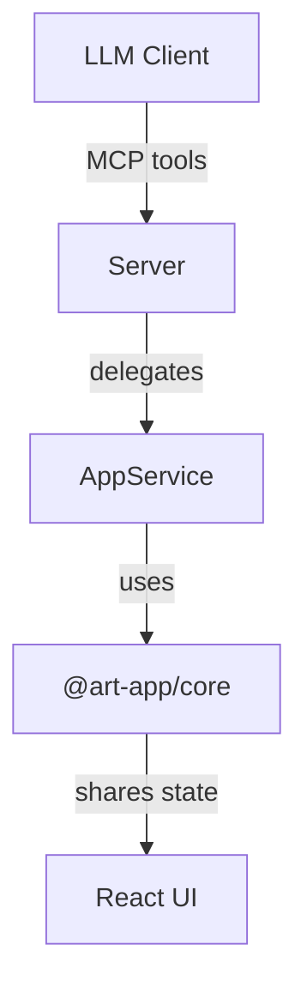

# MCP Architecture Overview

## Components
- **Core Module (`packages/core/`)**
  - Provides deterministic state management (`StateStore`), Zod schemas, serialization helpers, and randomization utilities.
  - Shared by React UI and MCP server to guarantee consistent logic.
- **MCP Server (`mcp-server/`)**
  - Entrypoint `src/index.ts` sets up `Server` with stdio transport.
  - `src/tools/` registers MCP tools delegating to `AppService`, which wraps `StateStore`.
  - `src/errors.ts` + `src/logger.ts` standardize error payloads and logging.
- **React UI (`src/`)**
  - Consumes shared core APIs via contexts; remains decoupled from MCP specifics.

## Data Flow

1. Client issues `tools/call` requests over stdio.
2. Server validates input via Zod schemas in `src/tools/index.ts`.
3. `AppService` mutates or reads state using `StateStore` and normalization helpers.
4. Responses are serialized as JSON strings in the tool reply.

## Determinism & Versioning
- `StateStore` assigns monotonically increasing `version` values; all mutating tools accept `expectedVersion`.
- Randomization relies on `generateSeed` and per-layer seeds via `normalizeLayer`.
- History stacks (`undo`, `redo`) capture metadata (`tool`, `note`, `argsHash`, `timestamp`).

## Error & Logging Strategy
- Errors normalized with `ToolError` (`code`, `message`, `details`).
- Logs prefixed `[MCP]` or `[MCP ERROR]` to distinguish informational vs error events.

## Testing Integration
- `packages/core/__tests__/stateStore.test.ts` validates history/version behavior.
- `mcp-server/src/tools/__tests__/registerTools.test.ts` ensures tool registry and error handling remain consistent.
- Performance tests (per memory) allow up to 4MB heap fluctuation to avoid flakiness.
